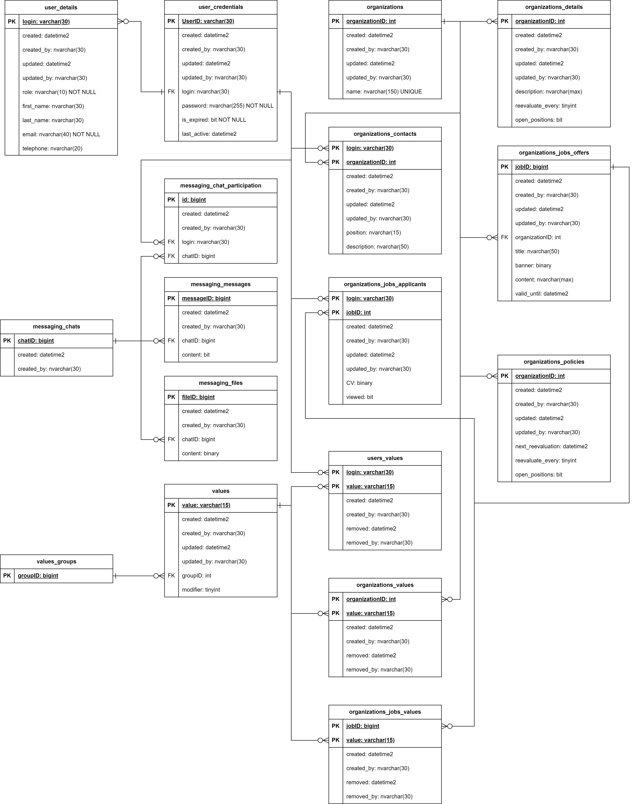

# ValuedIn-Documentation

ValuedIn is a professional social media based platform, that encourages honest approach to corporate values, where they are defined by the people working in the corporation, rather than what management states it to be.

[Quality Attributes](QualityAtrributes.docx) described in Lithuanian. English version TBD.

[OpenAPI specification](Swagger) prototype provided; For a less detailed approach, see the [API Matrix](ValuedIn_API_Endpoints.xlsx);

Also provided preliminary Database model for the project:

